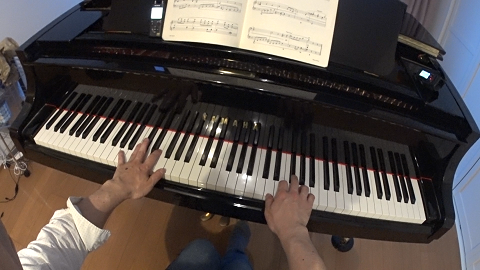
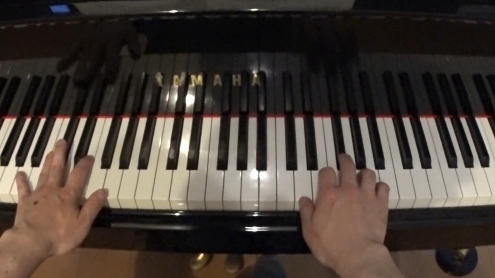

# Keyboard Tilt Compensation

## How to use

1. Edit "run.ps1"
   - replace input-filename and output-filename with yours

2. Right Click "run.ps1"

3. Select "Run with powershell"

## Images

1. Sample of an original Image

2. The aligned image

## Videos

